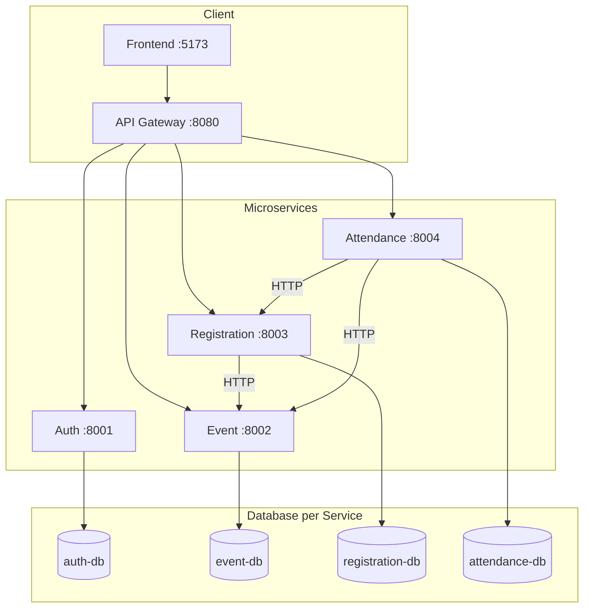

# KampusEvent — Microservices Project

Sistem manajemen event kampus berbasis microservices untuk mata kuliah Microservices Architecture.

### README per Service

- [kampusevent-auth-service/README.md](kampusevent-auth-service/README.md)
- [kampusevent-event-service/README.md](kampusevent-event-service/README.md)
- [kampusevent-registration-service/README.md](kampusevent-registration-service/README.md)
- [kampusevent-attendance-service/README.md](kampusevent-attendance-service/README.md)

## Arsitektur

**Decomposition:** 4 service per business capability.



## Alur Bisnis

1. User register/login via **Auth Service** (JWT + refresh httpOnly cookie)
2. Panitia buat event via **Event Service** (jadwal + status efektif otomatis)
3. Peserta daftar via **Registration Service** saat event **upcoming** → tiket
4. Panitia check-in via **Attendance Service** saat event **ongoing**
5. Organizer kelola kehadiran di Dashboard (check-in / batalkan)

## Repositories

| Repository | Port | Database | Deskripsi |
|------------|------|----------|-----------|
| [kampusevent-auth-service](https://github.com/KampusEvent/kampusevent-auth-service) | 8001 | auth-db | JWT, RBAC, user management |
| [kampusevent-event-service](https://github.com/KampusEvent/kampusevent-event-service) | 8002 | event-db | CRUD event, kuota, status |
| [kampusevent-registration-service](https://github.com/KampusEvent/kampusevent-registration-service) | 8003 | registration-db | Pendaftaran, tiket |
| [kampusevent-attendance-service](https://github.com/KampusEvent/kampusevent-attendance-service) | 8004 | attendance-db | Check-in, kehadiran |
| [kampusevent-infrastructure](https://github.com/KampusEvent/kampusevent-infrastructure) | — | — | Docker Compose, observability, E2E |

## Tim

| Developer | Repository | Port | Fokus Utama |
|-----------|------------|------|-------------|
| Valen | kampusevent-auth-service | 8001 | Register, Login, JWT, RBAC |
| Ardy | kampusevent-event-service | 8002 | CRUD Event, kuota, status |
| Valen | kampusevent-registration-service | 8003 | Pendaftaran, tiket, HTTP client ke Event |
| Yuga | kampusevent-attendance-service | 8004 | Check-in, kehadiran, HTTP client ke Registration |
| Valen | kampusevent-infrastructure | — | Docker Compose, Grafana, Jaeger, E2E tests |

## Quick Start (Full Stack)

```bash
cd kampusevent-infrastructure
cp .env.example .env
docker compose up --build
```

| URL | Keterangan |
|-----|------------|
| http://localhost:8080 | **API Gateway** (sole API entry point) |
| http://localhost:5173 | Frontend (`npm run dev` di `kampusevent-frontend`) |
| http://localhost:9090 | Prometheus |
| http://localhost:3000 | Grafana (admin/admin) |
| http://localhost:16687 | Jaeger |

> Port `:8001–8004` tidak exposed ke host — akses API hanya via gateway.

### Frontend

```bash
cd kampusevent-frontend
npm install && cp .env.example .env && npm run dev
```


1. **Database per Service** — tidak boleh query DB service lain
2. **Komunikasi hanya HTTP REST** — `httpx.AsyncClient` antar service
3. **JWT lokal** — decode di setiap service (shared `JWT_SECRET`), bukan call Auth per request
4. **Resilience wajib** — timeout 3s, retry 3x, fallback 503
5. **Layers** — router → service → repository
6. **Internal API key** — `GET /registrations/ticket/{code}` untuk Attendance only
7. **Resource ownership** — organizer hanya akses resource miliknya (admin bypass)
8. **Status rules** — registrasi `upcoming`, check-in `ongoing`
9. **Alembic** — migration otomatis saat container startup

## Keamanan

| Fitur | Detail |
|-------|--------|
| Refresh token | httpOnly cookie, access token di memory (frontend) |
| Internal API Key | `INTERNAL_API_KEY` — Registration ↔ Attendance |
| Event ownership | CRUD/check-in scoped ke `created_by` |
| Quota atomik | PostgreSQL advisory lock |
| API Gateway | Rate limiting + CORS credentials |

## Testing

```bash
# Per service (50 tests)
cd kampusevent-auth-service && pytest          # 13
cd kampusevent-event-service && pytest         # 13
cd kampusevent-registration-service && pytest  # 13
cd kampusevent-attendance-service && pytest    # 12

# E2E + contract + gateway (20 tests)
cd kampusevent-infrastructure/e2e-tests
pip install -r requirements.txt && pytest -v
```
