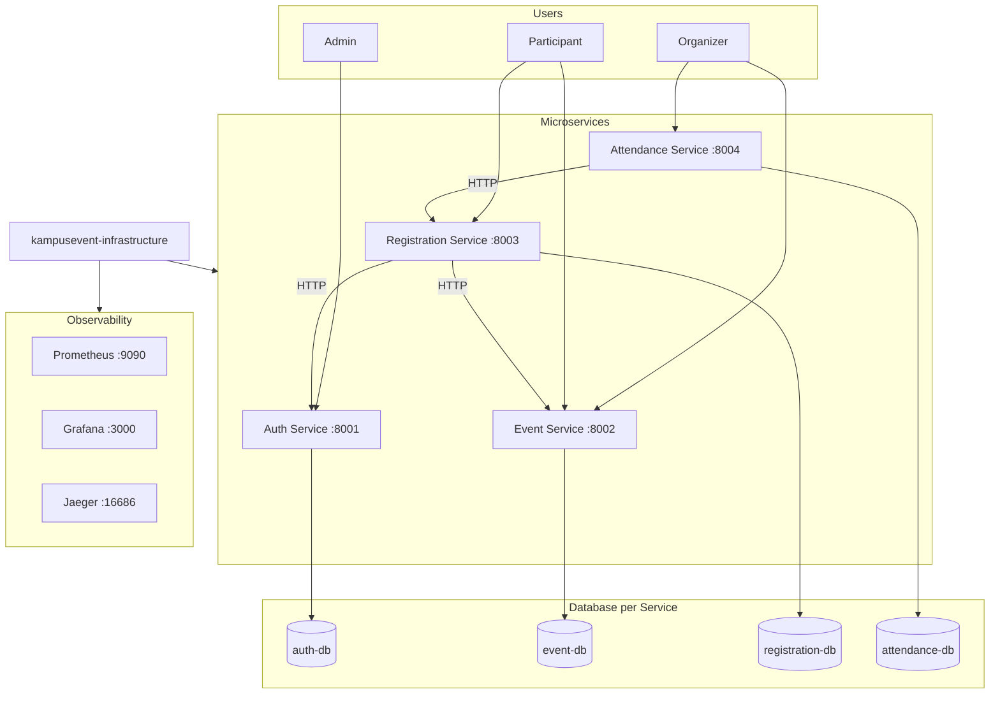

# KampusEvent — Microservices Project

Sistem manajemen event kampus berbasis microservices untuk mata kuliah Microservices Architecture.

## Dokumentasi

- [PROJECT GUIDE.txt](PROJECT%20GUIDE.txt) — Panduan implementasi teknis
- [Kampus Event.txt](Kampus%20Event.txt) — Deskripsi lengkap project

## Arsitektur



## Alur Sistem

1. User register/login via **Auth Service**
2. Panitia buat event via **Event Service**
3. Peserta daftar via **Registration Service** → validasi ke Event Service
4. Sistem generate kode tiket unik
5. Panitia check-in via **Attendance Service** → validasi ke Registration Service
6. Kehadiran tercatat

## Repositories

| Repository | Port | Database | Deskripsi |
|------------|------|----------|-----------|
| [kampusevent-auth-service](kampusevent-auth-service/) | 8001 | auth-db | JWT, RBAC, user management |
| [kampusevent-event-service](kampusevent-event-service/) | 8002 | event-db | CRUD event, kuota, status |
| [kampusevent-registration-service](kampusevent-registration-service/) | 8003 | registration-db | Pendaftaran, tiket |
| [kampusevent-attendance-service](kampusevent-attendance-service/) | 8004 | attendance-db | Check-in, kehadiran |
| [kampusevent-infrastructure](kampusevent-infrastructure/) | — | — | Docker Compose, observability, E2E |

## Matrix Assign Tim

Isi nama anggota tim di kolom **Developer**:

| Developer | Repository | Port | Fokus Utama |
|-----------|------------|------|-------------|
| __________ | kampusevent-auth-service | 8001 | Register, Login, JWT, RBAC |
| __________ | kampusevent-event-service | 8002 | CRUD Event, kuota, status |
| __________ | kampusevent-registration-service | 8003 | Pendaftaran, tiket, HTTP client ke Event |
| __________ | kampusevent-attendance-service | 8004 | Check-in, kehadiran, HTTP client ke Registration |
| __________ | kampusevent-infrastructure | — | Docker Compose, Grafana, Jaeger, E2E tests |

## Workflow Pengembangan

### 1. Setup repo masing-masing

```bash
cd kampusevent-auth-service   # ganti dengan repo kamu
cp .env.example .env
docker compose up --build     # dev standalone (service + DB sendiri)
```

### 2. Implementasi di repo sendiri

Setiap service sudah memiliki scaffold:

- `app/models/` — SQLModel ORM (TODO)
- `app/schemas/` — Request/Response Pydantic (TODO)
- `app/services/` — Business logic (TODO)
- `app/repositories/` — Data access (TODO)
- `app/api/router.py` — Endpoint definitions (TODO)

Baca **README.md** di repo kamu untuk API contract dan Definition of Done.

### 3. Integrasi via Infrastructure

Setelah fitur siap, test integrasi:

```bash
cd kampusevent-infrastructure
cp .env.example .env
docker compose up --build
```

### 4. Testing

```bash
# Di repo service
pytest

# E2E (dari infrastructure)
cd kampusevent-infrastructure/e2e-tests
pip install -r requirements.txt
pytest -v
```

## Aturan Penting

1. **Database per Service** — tidak boleh query DB service lain
2. **Komunikasi hanya HTTP REST** — gunakan `httpx.AsyncClient`
3. **Resilience wajib** — timeout 3s, retry 3x, fallback response
4. **Pisahkan layers** — router → service → repository
5. **Jangan expose ORM model** — gunakan schema terpisah

## Status Scaffold

Scaffold sudah disiapkan (health, metrics, logging, tracing, Docker, Alembic baseline). Business logic dan endpoint API **belum diimplementasi** — itu tugas masing-masing developer.

## Quick Start (Full Stack)

```bash
cd kampusevent-infrastructure
docker compose up --build
```

| URL | Service |
|-----|---------|
| http://localhost:8001/docs | Auth Swagger |
| http://localhost:8002/docs | Event Swagger |
| http://localhost:8003/docs | Registration Swagger |
| http://localhost:8004/docs | Attendance Swagger |
| http://localhost:9090 | Prometheus |
| http://localhost:3000 | Grafana (admin/admin) |
| http://localhost:16687 | Jaeger |
